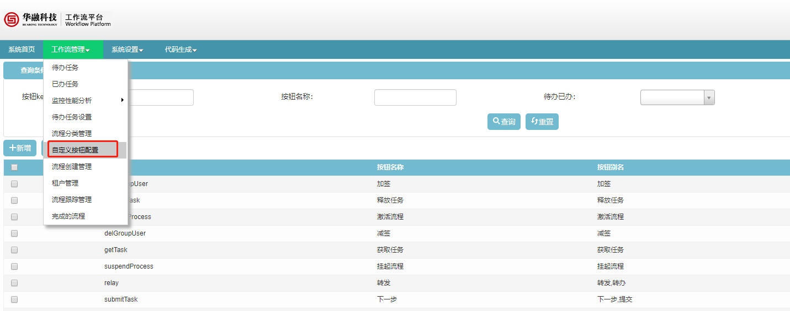
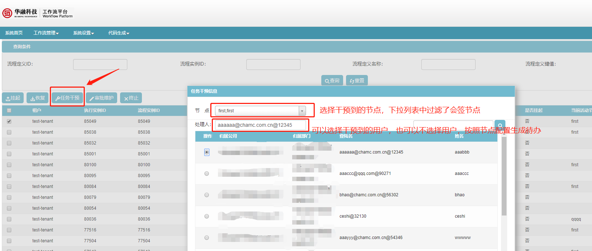
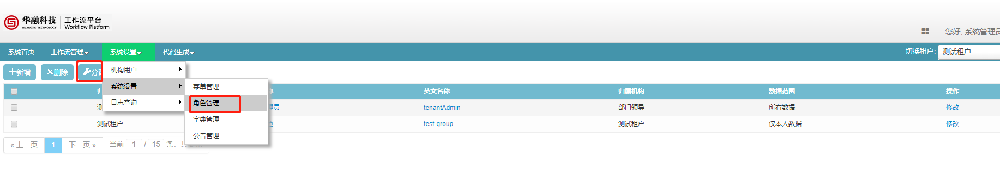
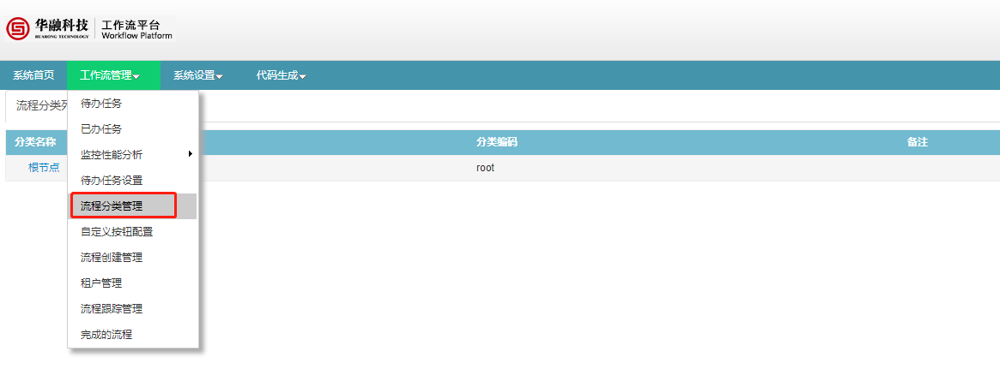
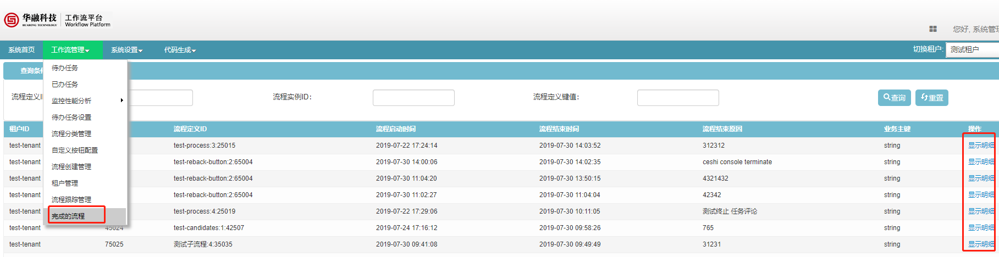

# 流程管理控制台

在流程控制台可以完成流程模型管理、流程跟踪、待办已办管理及系统设置等，使用时需要注意右上角的**租户**切换。

**注意**：
1. 原则上一个业务系统对应一个租户，新业务系统对接时，先联系管理员进行租户新建，不要在控制台进行操作。
2. 新建租户时需要提供租户标识及租户名，示例：租户标识bpm-api，租户名：工作流平台
3. 租户标识以小写字母及中划线组成，如bpm-api，如果注册到注册中心，尽量保证租户标识与注册中心的application.name相同

**租户申请流程**：    
1. 首先确认系统标识，以小写字母加中划线命名，如bpm-api；  
2. 在“服务管理系统”中申请对应环境token，如有疑问可联系唐红石；   
3. 发邮件给工作流管理员宗颍风，并抄送元明河，张光伟以及项目经理；   
4. 邮件标题：XX业务系统申请XX环境新建租户，内容包括：租户标识(与token中系统标识一致)以及租户名（即系统名），并标注是否需要对接KMS；   
5. 配置文件中请将spring.application.name配置为申请token时写的系统标识。 

## 自定义按钮配置

功能：维护按钮类型及别名等，在此处编辑保存的按钮，会在流程设计器中选择任务节点功能的时候勾选用到。最终会通过接口返回给调用者。

功能路径：工作流管理 -> 自定义按钮配置

可以新增按钮，也可以修改已有按钮的信息，如果同一种类型的按钮需要有多个别名的时候，在修改页面中编辑按钮别名即可，多个别名用英文的逗号隔开。原则上同一种类型的按钮不新建按钮，只根据需要修改/新增别名。

## 流程跟踪管理

功能路径：工作流管理 -> 流程跟踪管理

流程跟踪功能能够对流程实例进行干预，包括挂起、回复、任务跳转干预、审批维护及终止等。

挂起的流程，待办查询不到，可以通过点击恢复让流程回到正常状态。

选中一行数据后点击**任务干预**按钮，可进行任务干预。注意只能从普通节点干预到普通节点，干预节点列表过滤了会签节点。

1. 可以干预到当前节点，待办重新生成（taskId会发生变化）
2. 如果不选择处理人，则按照节点配置生成待办
3. 会签节点不能干预，也不能干预到会签节点

其他管理功能：
1. 选中一行数据，点击**挂起**按钮，可以将流程及其下的子流程挂起，挂起后流程不能进行操作。查询流程实例时SuspensionState字段为`SUSPENSION`
2. 选中一行数据，点击**激活**按钮，可以将流程及其下的子流程挂起，挂起后流程不能进行操作。查询流程实例时SuspensionState字段为`ACTIVE`
3. 选中一行数据，点击**审批维护**按钮，可查看该流程的流转明细及流程图示。
4. 选中一行数据，点击**终止**按钮，可以将流程终止。注意，不可以单独终止子流程，可以终止带子流程的父流程，父流程终止时子流程也一并终止。

关于子流程可以见[子流程章节](./4.2information-disign-1.3.0.RELEASE.md#子流程配置)

## 角色管理

功能路径：系统设置 -> 系统设置 -> 角色管理

可以对角色进行管理，包括角色信息查看。角色信息维护以及角色-人员维护请通过chamc模式下的角色同步服务iSyncRoleService进行维护。[SDK说明](./6.interface-1.3.0.RELEASE.md#isyncroleservice)

在角色管理下，勾选角色，点击**分配**可以看到角色下对应的用户，如下图所示。

## 流程分类管理

功能路径： 工作流管理 -> 流程分类管理

可以新增、删除、修改流程分类。每个租户下可以存在多个流程分类，发起流程时可以按此类别进行发起。

流程分类可以修改启用状态，如果设置为不可用，则发起流程时不可以新建该流程分类的流程，但是分类下当前正在流转的流程可以正常流转。

## 完成的流程

功能路径： 工作流管理 -> 完成的流程

可以在这里查询已经结束的流程实例，点击显示明细可以查看流转明细。
